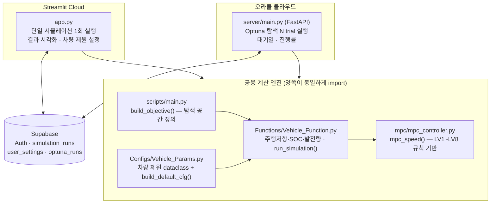
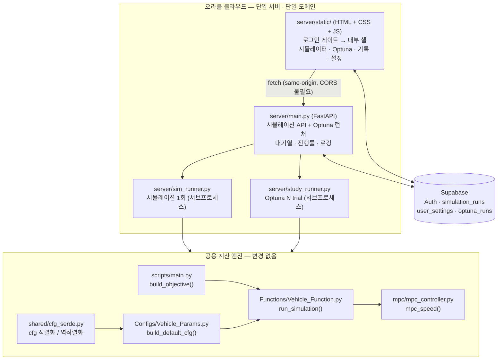

# WSC_DriveEff_Project

태양광 자동차(World Solar Challenge 출전 + 연구과제 + 포트폴리오) **주행효율 예측 MPC 시뮬레이터**.

Darwin~Adelaide 3,038km 경로에서 SOC·일사량·경사·풍향·에너지 예산을 바탕으로
**구간별 권장 최적 속도**를 계산하고, 27일 제한시간·컨트롤스탑 마감시각·법정
속도제한 같은 실제 대회 규칙 아래에서 완주 가능성을 시뮬레이션합니다.
(액추에이터를 직접 제어하지 않는 **어드바이저리 출력**)

> **이 저장소의 `.md` 파일이 프로젝트의 기준 문서입니다.**
> 작업 기준·현재 상태·다음 할 일은 항상 이 README와 `progress/`의 최신
> 백로그를 먼저 확인하세요. 대화 기록이 아니라 저장소에 남은 문서가 기준입니다.
>
> | 문서 | 역할 |
> |---|---|
> | `README.md` | 전체 요약 — 구조·원리·현재 상태·다음 할 일 (**여기서 시작**) |
> | `progress/44_향후_개선_과제_백로그.txt` | 지금 당장 다음에 할 일 (항상 가장 큰 번호가 최신 백로그) |
> | `progress/NN_주제.txt` | 완료된 작업별 상세 기록 |
> | `debug_logs/(날짜)_주제.txt` | 버그 추적·디버깅 과정 |
> | `SETUP.md` | 다른 컴퓨터에서 환경 재현하는 방법 |
> | `server/README.md` | Optuna 웹 런처 서버 배포 가이드 |
> | `CLAUDE.md` / `AGENTS.md` | AI 에이전트 작업 규칙 |

---

## 1. 시스템 구조

두 가지를 나란히 둡니다 — **지금 돌아가는 구조**와 **바뀔 구조**입니다.

> ⚠️ **전환 계획 진행 중**
> Streamlit Cloud를 접고 오라클 서버 하나로 통합하는 작업이 계획돼 있습니다
> (**Phase 0·1 완료**, Phase 2~6 남음). 상세:
> [`progress/43`](progress/43_웹통합_HTML전환_계획.txt) ·
> 실행 지시서: [`docs/codex_web_migration_tasks.txt`](docs/codex_web_migration_tasks.txt)
>
> **Phase 6이 완료되면 아래 「1-1. 현재 구조」 절을 통째로 삭제하고,
> 「1-2. 변경 예정 구조」를 정식 구조로 승격시킬 것.**

### 1-1. 현재 구조 〔Phase 6 완료 시 이 절 삭제 예정〕

지금 실제로 돌아가는 구조입니다. **앱 2개 + 공용 계산 엔진**으로 구성되고,
두 앱은 같은 Supabase 프로젝트를 공유해서 계정과 결과가 이어집니다.



| 계층 | 파일 | 역할 |
|---|---|---|
| 설정 | [`Configs/Vehicle_Params.py`](Configs/Vehicle_Params.py) | 차량 제원 dataclass 8종 + `build_default_cfg()` |
| 물리 엔진 | [`Functions/Vehicle_Function.py`](Functions/Vehicle_Function.py) | 주행저항·SOC·발전량 계산, `run_simulation()` 메인 루프 |
| 제어기 | [`mpc/mpc_controller.py`](mpc/mpc_controller.py) | `mpc_speed()` — LV1~LV8 규칙 기반 속도 결정 |
| 탐색 | [`scripts/main.py`](scripts/main.py) | `build_objective()` — **탐색 공간 정의는 여기 한 곳뿐** |
| 웹 앱 | [`app.py`](app.py) | Streamlit UI, 로그인, 결과 저장/조회 |
| 탐색 서버 | [`server/`](server/) | FastAPI 런처 + 별도 프로세스 탐색 실행 |

### 1-2. 변경 예정 구조 〔Phase 6 완료 후 이 절이 정식 구조〕

**아직 구현되지 않았습니다.** 오라클 서버 하나가 프론트와 API를 모두 서빙하고,
Streamlit은 사라집니다. 프론트와 API가 **같은 도메인**이라 CORS가 필요 없습니다.



**현재 대비 바뀌는 것**

| 항목 | 현재 (1-1) | 변경 후 (1-2) |
|---|---|---|
| 앱 개수 | 2개 (Streamlit Cloud + 오라클) | **1개** (오라클) |
| 프론트엔드 | Streamlit (Python) | **HTML + CSS + JS** |
| 시뮬레이션 실행 | 앱 프로세스 안에서 직접 | **서브프로세스 + 진행률 폴링** |
| CORS | `allow_origins=["*"]` | **불필요** (same-origin) |
| 로그 | 없음 (`DEVNULL`로 버려짐) | 요청·실행 이력·에러 (총 200MB 상한) |
| 경로 애니메이션 | 진행률과 무관한 장식용 반복 | **실제 진행률 반영** |
| 계산 엔진 | Python 공용 모듈 | **동일** — 손대지 않고 그대로 재사용 |

### 설계 원칙 두 가지 〔두 구조 공통〕

**① 설정은 전역이 아니라 `cfg` 인자로 전달한다.**
모든 설정값(`physics`/`solar`/`cell`/`pack`/`power`/`drive`/`race`/`simpara`)은
모듈 전역 싱글턴이 아니라 `cfg` → `const` dict로 함수에 전달됩니다. Streamlit
Cloud는 여러 사용자가 **서버 프로세스 하나를 공유**하기 때문에, 전역을 쓰면 한
사용자의 설정 변경이 그 순간 접속 중인 모든 사용자에게 새어 나갑니다.
실제로 이 버그가 두 번 발생했고(`progress/28`, `progress/36`) 둘 다 수정됐습니다.
**`run_simulation()`/`mpc_speed()`를 직접 호출하는 코드를 새로 쓸 때는 최신
시그니처(`cfg`/`const` 인자)를 반드시 확인하세요.**

> 🔒 **이 원칙은 Streamlit을 걷어내도 그대로 유효합니다.**
> FastAPI 서버도 여러 사용자가 프로세스 하나를 공유하는 건 똑같습니다(오히려
> 스레드/async가 섞여 더 까다롭습니다). "Streamlit 때문에 만든 패턴"으로 오해해서
> 마이그레이션 중에 `cfg` 인자를 걷어내면 `progress/28`·`36`의 버그가 그대로
> 되살아납니다. **전역 싱글턴으로 되돌리지 마세요.**

**② 탐색 공간은 한 곳에서만 정의한다.**
웹 런처가 `scripts/main.py`의 `build_objective()`를 import해서 씁니다. CLI로
돌리든 웹으로 돌리든 파라미터 범위가 갈라지지 않습니다.

---

## 2. 구동 원리

### 시뮬레이션 1스텝 (`run_simulation()` 루프, 경로 포인트마다 반복)

```
경로/기상 조회 → lookahead(향후 발전량·경사) → 필요 페이스(전체 완주·다음 CS)
  → 모터 디레이팅 → 법정 속도제한 조회
  → mpc_speed(step, params, const)   ← 여기서 권장속도 결정
  → dt 계산 → 컨트롤스탑 정차 처리 → 종료조건 검사(SOC/마감시각/27일)
  → 주행저항·발전량으로 SOC 갱신
```

종료 시 `(DataFrame, termination_reason)`을 반환하고, 앱이 이 사유로 결과 분석
메시지를 분기합니다(SOC 부족 / CS 마감초과 / 구간평균속도 미달 / 27일 초과 / 완주).

### `mpc_speed()` — 기저 속도 + 보정 누적 + 상한 클립

```
LV1 SOC 기반 기저속도 → LV2 경사(+momentum) → LV3 일사량 → LV4 에너지예산
→ LV5 정면풍 → LV8 필요페이스 가중평균 → 물리/법정 상한 클립 → EMA+tanh 댐퍼
```

단계별 상세는 아래 [MPC 속도 결정 로직](#mpc-속도-결정-로직) 참고.

### Optuna 파라미터 탐색

12개 파라미터를 TPE로 샘플링 → **고정된 5개 날씨 시나리오** 각각에서 시뮬레이션
→ 평균 점수(완주 시 평균속도 km/h, 미완주 시 `완주율 - 2`).

날씨를 고정하는 이유는 **common random numbers** — 매 trial마다 새 날씨를 뽑으면
"운 좋은 날씨를 만난 trial"이 이겨버려서 파라미터의 실력을 비교할 수 없습니다.
날씨 섭동은 포인트별 독립 노이즈가 아니라 **CS 구간(leg) 단위로 공유되는 z값**으로
흔듭니다 — 실제 날씨는 전선 단위로 뭉쳐서 움직이기 때문입니다.

### Optuna 웹 런처 (`server/`)

```
로그인(Supabase 토큰 검증) → 대기열(동시 실행 1개 제한)
  → subprocess로 별도 프로세스 실행 → 진행률/예상시간 표시
  → 20 trial마다 optuna_runs 테이블에 체크포인트
  → 완료 후 Streamlit 앱에서 "이 파라미터로 시뮬레이션하기"로 바로 적용
```

- **왜 별도 프로세스인가**: `study.optimize()`가 블로킹 호출이라 FastAPI 안에서
  돌리면 다른 요청까지 막히고, GIL 때문에 스레드로는 CPU-bound 순수 Python
  루프의 진짜 병렬이 안 됩니다.
- **디스크 로테이션**: 무료 인스턴스의 작은 디스크가 차면, 지금까지의 best_params를
  `enqueue_trial`로 이어받은 새 study로 교체해서 탐색을 계속합니다. 결과는 이미
  Supabase에 체크포인트로 남아 안전합니다.

---

## 3. 현재 진행 상황 (2026-08-05)

| # | 단계 | 상태 |
|---|------|------|
| 1 | 경로·환경 데이터 수집 / 차량 물리 모델 | **완료** |
| 2 | Rule-based MPC (LV1~LV5 ramp + LV8 페이스 블렌딩) | **완료** |
| 3 | Streamlit 시뮬레이터 UI | **완료** |
| 4 | 웹 배포 (Streamlit Cloud + Supabase + Optuna 런처) | **완료**(런처 실기동 검증 전) |
| 4-1 | 웹 통합 / HTML 전환 (`progress/43`) | **진행 중** — Phase 0·1 완료 / 2~6 남음 |
| 5 | MPC 물리 building block (코스팅/제동/내리막 캡) | **진행 중** |
| 6 | 비용함수 기반 MPC로 전환 | 설계 논의만 완료 |
| 7 | AI 예측 모델 (발전량 / 소비전력) — `ai_models/` | 미착수 |
| 8 | 강화학습 실험 — `rl/` | 미착수 |
| 9 | 실측 데이터 교체 | 미착수 |

### 최근 완료된 것

- **run_simulation() 한 사이클 계산 순서 정리** — ① 야간 경계 선처리(주행 불가
  시간이면 속도·에너지 계산을 건너뛰고 다음날 08:00으로 점프), ② 주행 에너지/SOC
  계산을 CS·신호등 이벤트보다 앞으로 이동("달려서 도착한 뒤 정차/충전" 순서),
  ③ `env_row` 누락 시 인접 시간 fallback 추가(에너지 계산을 건너뛰던 '공짜 주행'
  제거), ④ `light_arrive()` 단위/감지방식 수정 (`progress/38`, `39`, `40`)
- **[버그 수정] `light_arrive()` 단위 불일치** — 미터와 km를 비교해 신호등 지연이
  한 번도 발동하지 않던 오래된 버그. 이제 이전~현재 구간 안에 신호등이 들어오면
  감지하는 방식이라 경로 포인트가 신호등을 정확히 찍지 않아도 동작 (`progress/39`)
- **총괄 기획안 PDF** — 설계·구현·운영 전반을 정리한 15페이지 문서
  ([`docs/`](docs/), 생성 스크립트 포함)
- **Optuna 웹 런처(오라클) + 앱 연동** — Streamlit Cloud 무료 티어로는 탐색을 못
  돌린다는 제약을 별도 FastAPI 서버 분리로 해결. 대기열·진행률·체크포인트·디스크
  로테이션까지 구현. 앱 사이드바 "내 Optuna 탐색 결과"에서 결과 조회 및 적용
  (`progress/34`). ⚠️ **아직 실제 기동 테스트 안 됨**
- **자동 로그인 / 코드 보기** — refresh token을 브라우저 localStorage에 저장해
  새로고침해도 로그인 유지. GitHub raw에서 주요 파일을 읽기 전용 조회 (`progress/34`)
- **"시뮬레이션 설정" 탭 + `simpara` 세션 격리** — 신호등 대기시간, `soc_hard_stop`,
  `max_v_delta`, `decel_brake`를 앱에서 조정 가능 (`progress/34`)
- **[버그 수정] `mpc_controller.py`의 `simpara` 전역 참조 제거** — 속도 댐퍼가 세션
  `cfg`가 아니라 모듈 전역을 읽고 있어 사용자가 `max_v_delta`를 바꿔도 조용히
  무시되던 문제. 전 구간 시뮬레이션 A/B로 반영 확인 (`progress/36`)
- **`scripts/main.py` 재구성** — `build_objective()` / `run_best_params_simulation()`
  / `run_cli()`로 분리해 CLI와 웹 런처가 같은 탐색 공간 코드를 공유 (`progress/34`)
- **차량 제원 계정 저장/불러오기**, **릴리즈 노트 + 첫 로그인 튜토리얼**,
  **Supabase 로그인/기록 저장**, **종료 사유 추적 + 규칙 기반 결과 분석**
  (`progress/25`, `26`, `30`, `32`)

이전 이력 전체는 아래 [상세 진행 이력](#상세-진행-이력) 및 `progress/` 참고.

---

## 4. 다음에 할 일

> 자세한 내용은 [`progress/44_향후_개선_과제_백로그.txt`](progress/44_향후_개선_과제_백로그.txt)

### 1순위 — Optuna 웹 런처 실제 동작 검증
서버 코드가 인터넷 없는 환경에서 작성돼 **한 번도 실제로 띄워본 적이 없습니다.**
- [ ] 오라클 서버에서 `uvicorn server.main:app --host 0.0.0.0 --port 8000` 기동
      → 접속 확인 (오라클 콘솔에서 **포트 8000 Security List 개방** 필요)
- [ ] 로그인 → 탐색 시작 → 진행률 표시 → Streamlit 앱 "내 Optuna 탐색 결과"에
      반영 → "이 파라미터로 시뮬레이션하기"까지 한 번 관통 확인
- [ ] 배포본에서 자동 로그인·코드 보기 동작 확인
- [ ] 문제 없으면 systemd 등록 ([`server/README.md`](server/README.md) 절차)

### 2순위 (트랙 A) — 웹 통합 / HTML 전환 (**Phase 0·1 완료, 2~6 남음**)
> 트랙 A와 B는 서로 독립적입니다. 어느 쪽을 먼저 할지는 사용자 판단.
Streamlit UI를 HTML/CSS/JS + FastAPI로 전환하고 Optuna 런처와 한 웹으로 합칩니다.
**결정적 이유는 "다른 HTML 기반 웹과 합칠 예정"이라는 통합 제약**입니다
(Streamlit은 외부 사이트에 iframe으로만 넣을 수 있음). 시인성 개선과 서버 로그는
부차적 이유입니다. 전환 중에도 **Streamlit에 같은 UI 개선을 병행 적용**해서
팀원 사용 경험이 안 깨지게 합니다.
- 구조: 로그인 게이트 → 내부 셸(시뮬레이터 | Optuna | 기록 | 설정)
- Phase 0(로깅) → 1(셸+게이트) → 2(시뮬 API) → 3(시뮬 프론트) → 4(차량제원 모달)
  → 5(부가) → 6(전환·정리)
- ✅ **Phase 0 완료** (PR #1) — `server/logging_conf.py` 신설, 요청/실행 로그,
  자식 프로세스 출력을 `outputs/logs/run_{id}.log`로 보존(`DEVNULL` 제거)
- ✅ **Phase 1 완료** (PR #1) — `static/`을 `css/tokens.css` + `js/`(auth·nav·
  optuna·state)로 분리, 로그인 게이트 선배치. Streamlit도 병행 적용(v1.0.9,
  비로그인 시 `render_login_gate()` + `st.stop()`)
- ▶ **다음: Phase 2 (시뮬레이션 API)** — `shared/cfg_serde.py` 분리,
  `server/sim_runner.py` 신설, `WSC_MAX_SIM_CONCURRENT` 슬롯 분리, 결과 CSV TTL
- ⚠️ 1순위(런처 실기동 검증)는 **여전히 미완** — Phase 2부터는 실제 실행 검증
  (A/B 동등성 `V2-4`)이 필요하므로 이때는 서버가 실제로 떠야 합니다
- 상세 설계·주의사항·미해결 질문은
  [`progress/43_웹통합_HTML전환_계획.txt`](progress/43_웹통합_HTML전환_계획.txt)
- 실행용 지시서(Phase별 검증 조건·단계 게이트)는
  [`docs/codex_web_migration_tasks.txt`](docs/codex_web_migration_tasks.txt)
  — Codex 등 다른 에이전트에 작업을 넘길 때 이 파일을 전달
- 합칠 웹: 레포 밖 별개 사이트, HTML+CSS+JS+FastAPI, **오라클과 같은 도메인**
  (인증은 Supabase 유지) → **CORS 비이슈**. 그 사이트 디자인을 가져오고
  오라클이 시뮬레이터+Optuna를 둘 다 서빙
- 디자인 기준: **색은 기존 Optuna 페이지 팔레트**(녹색 `#2F6F4E` 계열),
  레이아웃·정보 구조는 현재 Streamlit과 유사하게. 디자인 자산을 기다리지 않고
  "임의 구성 후 수정" 방식 — 단 색·간격은 전부 `tokens.css`의 CSS 변수로만
  정의해야 나중 교체가 싸다 (검증 `V1-5d`가 grep으로 기계 검사)
- 🔒 **Streamlit은 Phase 6까지 유지** — `app.py`는 지금도 살아있고 팀원이 씁니다.
  Phase별 `[B]` 트랙으로 같은 UI 개선을 병행 적용 중

### 2순위 (트랙 B) — MPC 물리 building block 완성
설계는 `progress/22`에 완료돼 있고 코드만 없는 상태입니다.
- [x] 내리막 세그먼트 경계 배열 추출 (`scripts/main.py` 112~130줄)
      — 단, 아래 `compute_downhill_cap()`이 없어 **현재는 계산만 하고 미사용**
- [ ] `compute_downhill_cap(step, const)` 구현
      — `physics`/`drive`를 전역이 아니라 `const`에서 꺼내 쓸 것
      — 완성되면 `app.py`에도 같은 세그먼트 전처리 추가 필요 (현재 `main.py`에만 있음)
- [ ] CS 접근 코스팅/제동 구현 (`coast_distance = v²/(2·a_coast)`, `simpara.decel_brake`)
- [x] `simpara.decel_brake` 상수 추가(0.7g) + 앱에서 편집 가능
      — **단 아직 물리 로직에서 미사용**
- [x] `light_arrive()` 단위 불일치 버그 수정 — 이제 실제로 신호등 지연이 발동
      (43개 감지·중복 방지 확인, `progress/39`)
- [ ] 위가 끝나면 본격 Optuna 재탐색 (웹 런처로 실행 가능. CLI로 돌릴 거면
      `run_cli()`가 아직 스모크테스트 설정이라 `n_trials=50`,
      `study_name="WSC_MPC_Opt"`, `storage="sqlite:///outputs/optuna_study.db"`로 원복 필요)

> `Functions/Vehicle_Function.py`와 `mpc/mpc_controller.py`의 의사결정/물리
> 로직은 **사용자가 직접 작성**합니다 (`CLAUDE.md`/`AGENTS.md` 규칙).

### 3순위 — 문서/인프라 정리
- [ ] `optuna_runs` 테이블 SQL을 `SETUP.md`에 정리 (**현재 레포에 SQL 원문이 없음** —
      Supabase 재구축 시 코드에서 역추적해야 함)
- [ ] `SETUP.md`에 `server/` 배포 절차 링크 추가
- [ ] 서버 보안 검토 (CORS `*`, anon key 하드코딩 — RLS 전제라 당장 위험은
      아니지만 노출 범위 검토)

### 4순위 — 예전부터 보류 중
- [ ] 속도 정수(int) 출력 반영 (`results.append()` 시점에만 반올림, 내부 계산은 float 유지)
- [ ] `momentum_gain`을 Optuna 탐색공간에 넣을지 결정
- [ ] `termination_reason`을 `objective()` 스코어링에 활용할지 검토

---

## 5. 실행 방법

환경 구성 상세(venv, Python 버전, 같이 옮겨야 하는 파일)는 [`SETUP.md`](SETUP.md) 참고.

```powershell
py -3.12 -m venv .venv
.\.venv\Scripts\pip.exe install -r requirements.txt

# 웹 시뮬레이터 (권장)
.\.venv\Scripts\python.exe -m streamlit run app.py

# CLI 실행 (Optuna 최적화)
.\.venv\Scripts\python.exe scripts\main.py
```

Optuna 탐색 서버는 별도입니다 → [`server/README.md`](server/README.md)

`app.py` 실행에는 `.streamlit/secrets.toml`(Supabase URL/anon key)이 필요합니다.
이 파일은 `.gitignore`에 있으니 컴퓨터마다 새로 만들어야 합니다(`SETUP.md` 참고).

---

## 6. 폴더 구조

```
Configs/            차량 제원·시뮬레이션 파라미터 (dataclass)
  Vehicle_Params.py   VehiclePhysics, SolarPanel, BatteryCell, BatteryPack,
                      PowerSystem, Drivesystem, RaceConfig, SimulationParameter
                      + build_default_cfg() (세션별 독립 인스턴스 생성)
  speed_limits_2025.csv / traffic_lights_2025.csv   실제 대회 루트 규정 데이터
Functions/          차량 물리 계산·시뮬레이션 엔진
  Vehicle_Function.py  주행저항·SOC·발전량 계산, run_simulation()
mpc/                MPC 속도 플래너 (Rule-based, LV1~LV8)
  mpc_controller.py
Environment/        기상 데이터 수집 (Open-Meteo API)
  Open_Meteo_API.py
scripts/            CLI 실행 스크립트
  main.py             Optuna 파라미터 최적화 (build_objective()는 웹 런처도
                      import해서 재사용 - 탐색 공간 정의는 여기 한 곳뿐)
server/             Optuna 웹 런처 (오라클 서버에서만 구동, Streamlit과 별개)
  main.py             FastAPI - 인증/대기열/진행률 API + 정적 프론트 서빙
  study_runner.py     실제 탐색을 도는 별도 프로세스 (체크포인트·디스크 로테이션)
  static/index.html   로그인·실행·진행률 UI (순수 HTML/JS)
  wsc-launcher.service systemd 유닛 (재부팅 시 자동 기동)
  README.md           서버 배포 가이드
components/         Streamlit 커스텀 컴포넌트 (순수 HTML/JS, 빌드 불필요)
  route_animator/     경로 진행 애니메이션
  session_storage/    refresh token을 브라우저 localStorage에 저장 (자동 로그인)
assets/             정적 자산
  australia_silhouette.png  지도 배경용 호주 실루엣 (Natural Earth 데이터)
outputs/            시뮬레이션 결과물 + Optuna DB
  env_data.csv        305좌표 × 8일 × 12시간 = 29,280행
  optuna_study.db     Optuna study DB (재탐색 전이라 현재 없음, 최초 실행 시 생성)
docs/               문서
  WSC_DriveEff_총괄기획안.pdf   설계·구현·운영 전반 총괄 기획안 (15p)
  make_plan_pdf.py              위 PDF 생성 스크립트 (pip install reportlab 필요)
  agent_token_remote_optuna_guide.txt   Codex 자동 실행용 원격 런처 구현 가이드
progress/           진행상황 주제별 정리 (가장 큰 번호 = 최신 백로그)
debug_logs/         버그 추적·디버깅 과정 기록 ((YYYY-MM-DD)_주제.txt)
app.py              Streamlit 웹 시뮬레이터
2027 BWSC TRACK.csv 전체 경로 GPS 데이터 (Darwin~Adelaide, 3,038km)
SETUP.md            다른 컴퓨터로 옮길 때 환경 재현 방법
```

---

## MPC 속도 결정 로직

| 단계 | 기준 | 조절 방식 |
|------|------|----------|
| LV1 | SOC (soc_ramp_low~soc_ramp_high 구간) | v_min ~ v_soc_high 선형보간(ramp) |
| LV2 | 경사도 look-ahead (현재~2km 앞 구간평균) + 직전 가속도(momentum) | slope_k 비례 감가속(ramp), 오르막 진입 시 momentum_gain*a로 페널티 완화 |
| LV3 | 일사량 비율 (게이트 없이 항상 적용) | radi_para 비례, radi_risk*gen_ratio_std로 불확실성 할인(ramp) |
| LV4 | 에너지 예산 (다중 지점 가중평균 발전량 기반, 구 LV7 병합) | energy_v 비례 감속(ramp) |
| LV5 | 정면풍 성분 | winddir_para 비례, 대칭 클리핑(ramp) |
| LV8 | 시간 예산 (전체완주 페이스 + 다음CS 페이스 2-신호 블렌딩) | SOC 여유(soc_cutoff 초과)에 비례해 목표 페이스로 블렌딩 |

SOC가 `soc_cutoff` 이하로 떨어지면 위 결과와 무관하게 `v_min`으로 강제 고정(하드
안전장치, `soc_hard_stop`과 함께 유일하게 계단형으로 남은 로직). 스텝 간 속도
변화량도 EMA+tanh 댐퍼(`alpha`, `simpara.max_v_delta`)로 제한 — 빠른 오실레이션은
감쇠, 느린 추세는 그대로 따라가되 한 번의 큰 이상치는 물리적 상한(차량 최대
가감속 능력)에서 포화.

법정 속도제한 클립은 **반드시 `v_min` 하한 클램프보다 뒤**에 와야 합니다. 순서가
바뀌면 `v_min` 강제 로직이 그보다 낮은 속도제한(예: CS 진입 25km/h)을 덮어씁니다.

LV6은 존재하지 않고(설계 당시 결번), 구 LV7(미래 일사량 추세)은 LV4에 병합됐습니다.
파라미터 이름은 전부 LV 번호 접두어를 뗀 역할 기반 이름을 씁니다 — 로직 순서가
바뀔 때마다 번호를 다시 매겨야 하는 문제 때문에 폐기했습니다
(`debug_logs/(2026-07-17)_LV3_게이트_제거_LV4_LV7_병합_및_mpc_speed_리팩터링.txt`,
`debug_logs/(2026-07-13)_LV8_시간예산_설계.txt`).

### 현재 모델의 한계 (실제 MPC 정의 대비)

- **없는 것**: 명시적 예측 모델 기반 수치 최적화(매 스텝 비용함수를 실제로 풂),
  명시적 objective function, 제약조건을 최적화 내부에서 다루는 것
  (현재는 `soc_cutoff`/`v_max`/`speed_limit` 전부 **사후 클리핑**)
- **있는 것**: receding horizon(매 스텝 상태 재측정 후 재계산), 상태 피드백,
  부분적 예측(`avg_gen_ratio`, `slope_ahead`)

전환 순서는 합의돼 있습니다 — 위 2순위(코스팅/제동/세그먼트)를 규칙 기반으로 먼저
완성해 물리적 타당성을 검증한 뒤, 같은 항들을 비용함수+solver로 재구성합니다.

---

## 차량 제원 요약

| 항목 | 값 |
|------|-----|
| 차량 질량 | 250 kg |
| Cd | 0.081 |
| 태양광 패널 | 6.0 m², 27% |
| 배터리 (HV) | Molicel P60B, 40S3P, ~2,592 Wh |
| 모터 정격 | 1,800 W, 150 V DC |
| 최대속도 | ~155 km/h (이론) |

---

## 상세 진행 이력

<details>
<summary>펼쳐서 보기 (2026-08-02 이전 주요 작업)</summary>

- **차량 제원 계정 저장/불러오기**: `user_settings` 테이블(사용자당 1행, JSON)에
  저장/불러오기 버튼 추가. "내 시뮬레이션 기록" 각 행에서도 그때 썼던 차량 제원을
  불러올 수 있음 (`simulation_runs.vehicle_cfg`) (`progress/30`)
- **[버그 수정] 차량 제원 설정이 전역 상태로 새서 모든 사용자에게 반영되던 멀티유저
  버그**: 다이얼로그가 `Configs.Vehicle_Params`의 전역 싱글턴을 직접 mutate하고
  있어서, 서버 프로세스를 공유하는 환경에서 한 사용자의 설정 변경이 모든 사용자에게
  반영되던 문제. `cfg`를 인자로 넘기는 구조로 변경해 완전 격리 (`progress/28`)
- **GitHub 레포 생성 + Streamlit Cloud 배포**: GitHub Pages 프론트 + Supabase
  백엔드 아키텍처는 무거운 Python 연산이 핵심인 이 프로젝트엔 안 맞아 기각,
  Streamlit 단일 배포로 결정 (`progress/24`)
- **Supabase 로그인 + 기록 저장/조회**: 회원가입(닉네임)/로그인/닉네임 수정,
  로그인해야 실행 가능, "결과 서버에 저장" 버튼으로 명시적 저장. Supabase
  클라이언트는 세션별 격리(멀티유저 인증 세션 섞임 방지) (`progress/25`)
- **종료 사유 추적 + 규칙 기반 결과 분석**: AI API 연동은 실제 과금(공개 앱이라
  방문자가 누를 때마다 소유자 비용 발생) 문제로 기각, `run_simulation()`이
  `(df, termination_reason)`을 반환하도록 하고 케이스별 분기 메시지로 대체
  (`progress/26`)
- **실제 2025 BWSC 속도제한/신호등 데이터 반영**: 공식 Route Notes PDF에서 추출한
  CSV를 `mpc_speed()`에 연결 (`progress/20`)
- **Optuna 날씨 섭동 CS 구간 상관화**: 포인트별 독립 노이즈 대신 CS 구간마다
  공유되는 z값으로 흔들어 실제 날씨 패턴에 근접 (`progress/21`)
- **오르막/내리막 지형 세그먼트 전처리** (`read_path()`): 20m 원본 slope는 고도
  노이즈가 과대증폭돼 500m 이동평균으로 스무딩 후 판정 (`progress/22`)
- **`run_simulation()` 함수 분리 (6/6)**: 200줄 넘던 함수를 6개 헬퍼로 분리(약
  160줄로 축소), A/B 비교로 도달거리 차이 0.1% 확인 (`progress/14`, `19`)
- **가속도(a) 동적 계산 + LV2 momentum 결합**: 고정 상수였던 가속도를 매 스텝
  실측 기반으로 계산, 오르막 진입 시 직전 가속도로 페널티 완화 (`progress/16`)
- **성능 버그 수정(4.2배)**: `dist_vals`가 numpy 배열이 아니라 pandas Index라
  `compute_lookahead()` 샘플링 루프가 pandas 내부 경로를 타고 있었음(cProfile로
  전체 실행시간의 74% 확인). `.to_numpy()` 한 줄로 214초 → 51초 (`progress/17`)
- **스텝 변화량 제한을 EMA+tanh 댐퍼로 전환** (`progress/13`)
- **MPC 파라미터 이름 전면 개편**: LV 번호 접두어 폐기, 역할 기반 이름으로 전환
- **LV1/LV2/LV5 계단형 → 연속(ramp) 통일**, LV3 SOC 게이트 제거, LV4+LV7 병합
- **야간 데이터 처리 버그 수정(중대)**: HR==17에 날짜 전환이 안 되던 버그,
  A/B 테스트로 993km(35%) 도달거리 차이 확인 후 수정
- **컨트롤스탑 규칙**(2025 실전 오픈/마감 시각 + 구간평균속도 60km/h) 실격 로직
  완성 및 검증
- **날씨 불확실성 반영**: common random numbers(K=5 고정 시드) 로버스트 탐색 확립

</details>
